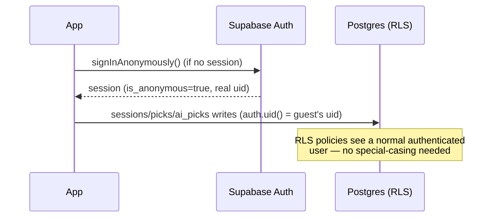
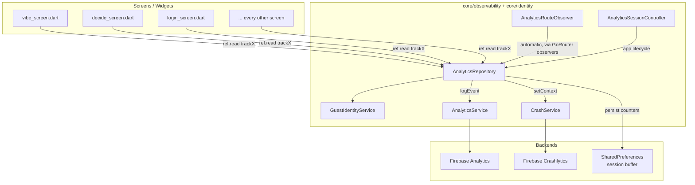

# Guest Mode & Analytics Architecture

How trombl tracks every user — guest or registered — from first launch through signup, without ever requiring login to use the app.

---

## 1. The core decision: guest identity = Supabase anonymous auth

The brief asked for a locally-generated UUID stored in `flutter_secure_storage`. That was deliberately **not** built — here's why, and what was built instead.

Every table in this app (`sessions`, `picks`, `ai_picks`, `plans`, `memory_nodes`, `notifications`, ...) is keyed by `auth.uid()` and RLS-scoped to it. A locally-generated guest id has no `auth.uid()` behind it — a guest could authenticate-free browse the marketing copy, but the moment they tried to pick a vibe or get an AI suggestion, every repository call would fail RLS, because there'd be no Postgres session to attach the write to. Making that work the "literal spec" way would mean either:

- Rewriting every repository and RLS policy to understand a second, parallel identity system, or
- Relaxing RLS to allow anonymous writes keyed by a client-supplied id (a security regression — anyone could write rows as any guest id).

Instead, guest mode is backed by **Supabase anonymous sign-in**. On first launch (`GuestIdentityService.bootstrap()`, called in `main.dart` before `runApp()`), the app calls `auth.signInAnonymously()` if there's no session at all. That creates a real `auth.users` row with `is_anonymous = true` — a real `auth.uid()` — so **every existing repository, RLS policy, and provider in the app keeps working completely unmodified**, for guests and registered users alike. Zero schema changes, zero RLS changes.



### Conversion preserves identity — not just a mapping

When a guest signs up, `GuestIdentityService.beginUpgrade(email)` calls `auth.updateUser(email: ...)` on the **same session** — Supabase's documented anonymous→permanent conversion path. Confirming the OTP/link (`confirmUpgrade`, using `OtpType.emailChange`) flips `is_anonymous` to `false` **without changing the user id**. Every `sessions`/`picks`/`ai_picks`/`memory_nodes` row the guest wrote stays attached to the exact same id.

This is strictly better than the brief's literal "old_guest_id → new_user_id" mapping: there's no mapping step, no possible loss, no migration job. `trackSignupCompleted()` still logs both fields for parity with anyone building a funnel against the literal names — they're just always equal in this implementation.

### What this means for the router

`app_router.dart`'s redirect guard (`if (!loggedIn ...) return '/login'`) already treats `currentUserProvider != null` as "logged in" — and that's now true for anonymous sessions too, with **zero changes to the guard itself**. The existing per-screen safety net (`onboardingCompletedProvider` in `vibe_screen.dart`) already redirects anyone — guest or registered — to `/onboarding` if they haven't completed it, so the tutorial → onboarding → vibe funnel applies identically to both. The one deliberate behavioral difference: `/setup` (display name) is only ever reached via the explicit login flow, so guests skip it — no forced "what's your name" prompt before they've tried anything.

### Caveat

This requires **"Allow anonymous sign-ins" enabled** in the Supabase dashboard (Authentication → Settings) for the live project. If it's off, `bootstrap()` fails soft and the app behaves exactly as it did before this change — `/login` is required. Nothing breaks either way; guest mode simply doesn't activate until that's turned on.

---

## 2. Architecture layers



| Layer | File | Responsibility |
|---|---|---|
| `GuestIdentityService` | `core/identity/guest_identity_service.dart` | Wraps Supabase anonymous auth: bootstrap, `isGuest`/`userType`, upgrade flow |
| `AnalyticsRepository` | `core/observability/analytics_repository.dart` | **The single front door.** Merges base params, owns session counters, debug-prints, calls `AnalyticsService` |
| `AnalyticsEvent` / `AnalyticsEvents` | `core/observability/analytics_event.dart` | Value type + central event-name constants (no magic strings) |
| `AnalyticsRouteObserver` | `core/observability/analytics_route_observer.dart` | `NavigatorObserver` plugged into `GoRouter(observers: [...])` — automatic `screen_view` on every navigation, no per-screen code |
| `AnalyticsSessionController` | `core/observability/analytics_session_controller.dart` | `WidgetsBindingObserver` — session start/end on app foreground/background |
| `AnalyticsService` | `core/observability/analytics_service.dart` | Thin Firebase SDK wrapper. **The only file allowed to import `firebase_analytics`** |
| `CrashService` | `core/observability/crash_service.dart` | Firebase Crashlytics wrapper, now with `setContext()` for guest_id/user_type/screen/session_id custom keys |

**Rule enforced throughout the migration:** no screen imports `AnalyticsService` or `firebase_analytics` directly anymore. Every call site goes through `ref.read(analyticsRepositoryProvider).trackX(...)`.

---

## 3. Common parameters (attached to every event, automatically)

`AnalyticsRepository._trackInternal()` merges these into every single event before it reaches Firebase — no call site has to remember any of it:

| Param | Source |
|---|---|
| `guest_id` | `GuestIdentityService.currentId` (the Supabase `auth.uid()` — guest or registered) |
| `user_type` | `'guest'` \| `'registered'`, from `GuestIdentityService.userType` |
| `platform` | `defaultTargetPlatform` (web-safe; no `dart:io`) |
| `app_version` / `build_number` | `package_info_plus`, fetched once at boot |
| `device_language` | `PlatformDispatcher.instance.locale` (web-safe) |
| `timezone` | `DateTime.now().timeZoneName` |
| `current_screen` / `previous_screen` | Maintained by `AnalyticsRouteObserver` on every navigation |
| `session_id` | Set by `AnalyticsSessionController` at app foreground |

---

## 4. Session tracking & local buffering

`AnalyticsRepository` keeps a running session (start → counters → end), persisted to `SharedPreferences` (`trombl_analytics_session_v1`) after every event — not a full local database, just enough state to survive a kill:

- `event_count`, `ai_calls`, `options_selected`, `vibe`
- On clean end (`endSession()`, fired from `AppLifecycleState.paused`/`detached`): logs `session_ended` with the final counters, clears the buffer.
- On next boot, if a buffer is still present (previous session never got a clean end — crash, force-quit, OS kill), it's flushed as `session_ended_recovered` before a new session starts. This is the "store locally until uploaded" requirement, scoped to what a session actually needs instead of a general-purpose offline event queue.

---

## 5. Automatic screen tracking

`AnalyticsRouteObserver` is attached via `GoRouter(observers: [...])` in `app_router.dart`. It reads `route.settings.name`, which GoRouter already sets to the matched location (e.g. `/plan/123`) — **no `name:` had to be added to any of the 20+ existing `GoRoute` entries**, and no screen has a manual `trackScreenView` call. Every push/pop/replace fires exactly one `screen_view` event with `screen_name`, a derived `screen_class` (e.g. `/create-plan` → `CreatePlanScreen`), and `time_spent_ms` on the screen being left.

---

## 6. The funnel, end to end

```mermaid
flowchart TD
    A[app_opened] --> B{loggedIn?}
    B -->|guest, fresh anon session| C[tutorial_started]
    B -->|returning, onboarding done| H[vibe_selected]
    C --> D[tutorial_completed / tutorial_skipped]
    D --> E[onboarding_started]
    E --> F[onboarding_completed]
    F --> H
    H --> I[category_opened]
    I --> J[option_selected]
    H --> K[ai_decide_started]
    K --> L[ai_reroll]*
    L --> K
    K --> M[ai_decide_completed]
    M --> N[ai_accepted]
    J --> O[reaction_loaded]
    N --> O
    O --> P[action_launched]
    P --> Q[checkin_started]
    Q --> R[checkin_completed]
    R --> S[summary_viewed]
    S --> T[session_ended]
    T -.next day.-> A

    H -.profile banner.-> U[signup_prompt_shown]
    U --> V[signup_started]
    V --> W[signup_completed / guest_converted]
```

Every node above is a real `track*` call wired into a screen in this change — not aspirational.

---

## 7. Guest → registered conversion UX

- **Profile screen**: a dismissable-by-navigation banner ("ur browsing as a guest — sign up so u don't lose this") shown only when `GuestIdentityService.isGuest`, linking to `/login`.
- **`/login` as upgrade screen**: when reached with an active anonymous session, the exact same screen used for fresh sign-in now upgrades in place (`beginUpgrade`/`confirmUpgrade` instead of `signInWithOtp`/`verifyOTP`), with copy that changes to "save ur progress before u lose it."
- **Sign-out guard**: signing out an anonymous user permanently deletes that identity (and everything written under it) with no recovery — both sign-out entry points on the profile screen now show a confirmation dialog for guests specifically, offering "sign up instead" before allowing the destructive action. Registered users are unaffected — no extra dialog for them.

---

## 8. Debug mode

Every event prints to console in `kDebugMode` (and is **not** sent to Firebase, matching the existing pre-guest-mode convention of disabling collection in debug):

```
📊 Event
event: vibe_selected
parameters:
  guest_id: 3f9a2e10-...
  user_type: guest
  platform: android
  ...
  vibe: fomo
```

---

## 9. Future-proofing for Google/Apple login

No code for Google or Apple sign-in exists yet (no packages in `pubspec.yaml` for either) — out of scope here. But because guest identity is just a Supabase session, adding either later is additive: Supabase's `linkIdentity()` API attaches an OAuth identity to the *same* anonymous session exactly like `updateUser(email:)` does for email today. Analytics needs zero changes — `GuestIdentityService.currentId`/`userType` already read live off whatever the current session is, regardless of which provider it came from.

---

## 10. What was deliberately left out

- **No new dependencies.** `package_info_plus` and `shared_preferences` were already in `pubspec.yaml`; `flutter_secure_storage` was dropped entirely once Supabase's own session persistence replaced the need for a separately-stored UUID.
- **Web Firebase Analytics**: this app has never had a web Firebase config (see `README.md` — messaging was already mobile-only). Guest identity and local/debug analytics work fully on web; events simply don't reach the Firebase console on web until that's set up, which is a pre-existing constraint, not a regression introduced here.
- **`comingSoonTapped` wiring**: the event method exists (carried over from the previous `AnalyticsService`), but tapping a "coming soon" option was already a generic repository `Failure` path before this change, not a distinct branch — left as-is rather than risk changing existing UX/copy under an unrelated task.
