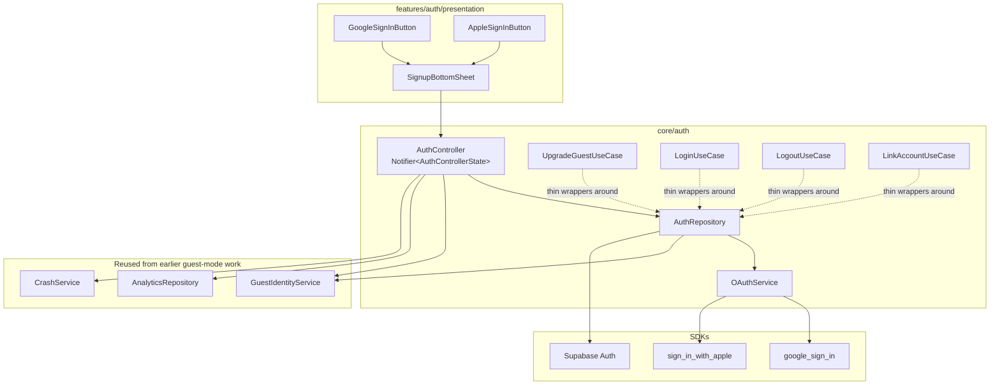
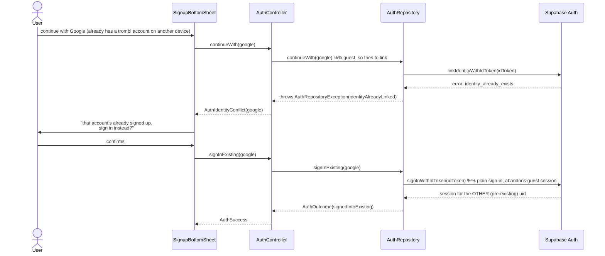

# Authentication Architecture — Google/Apple Upgrade for Guests

How a guest (anonymous Supabase session — see `docs/ANALYTICS_ARCHITECTURE.md` §1 for why guest mode is built that way) becomes a permanent account via Google or Apple, without ever creating a second user for the same person.

---

## 1. The core mechanism: identity linking, not a new sign-up

Supabase Auth's `linkIdentityWithIdToken` attaches a provider identity (Google or Apple) to **whatever session is currently active** — including an anonymous one — without changing its user id. `signInWithIdToken` is the opposite: a normal sign-in/sign-up that ignores any current session and resolves to whichever permanent user that identity already belongs to (or creates a new one).

Which one gets called is the *entire* guest-upgrade-vs-existing-account decision. Everything downstream — RLS, repositories, analytics, the rest of this app — only cares about the resulting user id, and is otherwise unaffected.

```mermaid
flowchart TD
    A[User taps Continue with Google/Apple] --> B{Currently a guest?}
    B -- yes --> C[linkIdentityWithIdToken]
    B -- no / no session --> D[signInWithIdToken]
    C -- success --> E[Same uid, is_anonymous flips to false]
    C -- "identity already belongs<br/>to another user" --> F[AuthIdentityConflict state]
    F -- user confirms --> D
    D -- success --> G[Resolves to that account's uid<br/>guest session abandoned]
```



### Why native ID tokens, not a browser/webview OAuth redirect

Supabase also offers `getLinkIdentityUrl`/`signInWithOAuth` (a browser-redirect flow). That was deliberately **not** used here: `linkIdentityWithIdToken`/`signInWithIdToken` take a native idToken obtained from `google_sign_in`/`sign_in_with_apple` directly, which is faster (no browser hop for Google, and the actual native Apple sheet on iOS), and is what the rest of this doc's native-SDK configuration (SHA1/SHA256, entitlements, nonce) is for. The trade-off: Apple sign-in on Android/web has no native SDK at all and falls back to a Chrome Custom Tab / web popup — see §6.

---

## 2. Architecture layers



| Class | File | Job |
|---|---|---|
| `OAuthService` | `core/auth/oauth_service.dart` | Native token acquisition only — never touches Supabase |
| `AuthRepository` | `core/auth/auth_repository.dart` | The link-vs-sign-in decision, error mapping, profile sync, sign-out |
| `AuthController` | `core/auth/auth_controller.dart` | UI state machine (`AuthIdle`/`AuthLoading`/`AuthSuccess`/`AuthFailed`/`AuthIdentityConflict`), wires analytics + Crashlytics around `AuthRepository` calls |
| `UpgradeGuestUseCase` | `core/auth/use_cases/upgrade_guest_use_case.dart` | Named wrapper around `AuthRepository.continueWith` |
| `LoginUseCase` | `core/auth/use_cases/login_use_case.dart` | Named wrapper around `AuthRepository.signInExisting` |
| `LogoutUseCase` | `core/auth/use_cases/logout_use_case.dart` | Named wrapper around `AuthRepository.signOut` |
| `LinkAccountUseCase` | `core/auth/use_cases/link_account_use_case.dart` | Adding a *second* provider to an already-registered account — distinct from guest upgrade, see `AuthRepository.linkAdditionalIdentity` |
| `SignupBottomSheet` | `features/auth/presentation/signup_bottom_sheet.dart` | The UI — Google/Apple buttons, maybe-later, "or use email instead" (reuses the pre-existing OTP upgrade flow in `login_screen.dart`), error/conflict banners with retry |

**Nothing new was introduced for identity, analytics, or crash reporting** — `GuestIdentityService`, `AnalyticsRepository`, and `CrashService` are the exact classes from the guest-mode work, only extended (new event names, a `provider` custom key, `currentUserCreatedAt`).

---

## 3. Guest lifecycle (end to end)

```mermaid
sequenceDiagram
    actor User
    participant App
    participant Guest as GuestIdentityService
    participant Sheet as SignupBottomSheet
    participant Ctrl as AuthController
    participant Repo as AuthRepository
    participant OAuth as OAuthService
    participant Supa as Supabase Auth

    App->>Guest: bootstrap() at launch
    Guest->>Supa: signInAnonymously() (if no session)
    Supa-->>Guest: anonymous session, uid=X

    User->>App: uses the app (vibes, picks, AI decides...)
    Note over App: all written under uid=X via existing repositories

    User->>App: taps "save ur progress"
    App->>Sheet: showSignupBottomSheet()
    Sheet->>Ctrl: trackGuestSignupPromptViewed
    User->>Sheet: taps "continue with google"
    Sheet->>Ctrl: continueWith(google)
    Ctrl->>Repo: continueWith(google)
    Repo->>OAuth: signInWithGoogle()
    OAuth-->>Repo: idToken
    Repo->>Supa: linkIdentityWithIdToken(idToken)
    Supa-->>Repo: session, uid=X, is_anonymous=false
    Repo->>Repo: sync profile (display_name only if unset; avatar/email always)
    Repo-->>Ctrl: AuthOutcome(guestUpgraded, uid=X)
    Ctrl->>Ctrl: trackGuestUpgraded, trackSignupSuccess, CrashService.setContext
    Ctrl-->>Sheet: AuthSuccess
    Sheet->>Sheet: pop (no forced restart)
```

Every `sessions`/`picks`/`ai_picks`/`memory_nodes`/`notifications` row written while `uid=X` was anonymous is **still attached to uid=X** after this — there is no copy/migrate step because there was never a second user.

### Fresh install, taps Google immediately

Because `main.dart` always calls `GuestIdentityService.bootstrap()` before `runApp()`, there is no code path where a user reaches any UI — including a hypothetical "sign up" button on a cold start — without already having an anonymous session. So "fresh install → Google immediately" and "guest → Google" are **the same flow** in this app; the spec's "don't create an anonymous user first" concern is satisfied structurally, not by a special case.

---

## 4. OAuth lifecycle — returning users & conflicts



**This is the one place data continuity is genuinely not possible.** Two different Supabase users already exist (the guest's anonymous one, and the real account from the other device); there's no automatic merge. The UI is explicit about this before it happens — see the conflict banner copy in `signup_bottom_sheet.dart`.

---

## 5. Profile sync rules

`AuthRepository._syncProfile` (called after every successful link or sign-in):

| Field | Rule |
|---|---|
| `display_name` | Only written if the existing profile's `display_name` is null/empty — **never overwrites a name the user already set** |
| `avatar_url` | Always synced from the provider (new field — no prior user edits to protect) |
| `email` | Always synced from `user.email` |
| `auth_provider` | Always set to `'google'` \| `'apple'` |

`avatar_url`/`email`/`auth_provider` are written via `SessionRepository.updateOAuthProfileFields` — a **separate** upsert call from `updateProfile` (display_name/handle/city/lifestyle), deliberately. A single Postgres upsert fails as one unit; if the new columns aren't migrated yet (see §8), this isolates that failure so the always-safe fields still get written.

---

## 6. Provider configuration

### Google (all platforms)

1. Google Cloud Console → Credentials → create an OAuth 2.0 **Web application** client → this is `GOOGLE_SERVER_CLIENT_ID` (passed via `--dart-define`, read in `AppConfig.googleServerClientId`). Required even for Android/iOS — it's the `aud` Supabase validates the idToken against.
2. Create an OAuth client for **Android** (package name `com.trombl.app` per the existing manifest, plus the release/debug **SHA-1 and SHA-256** signing fingerprints — get these via `./gradlew signingReport` in `android/`).
3. Create an OAuth client for **iOS** (bundle id) → download the resulting config and merge it into `GoogleService-Info.plist` → copy its `REVERSED_CLIENT_ID` value into `ios/Runner/Info.plist`'s `CFBundleURLTypes` (a placeholder entry is already there — see the comment in that file).
4. Supabase → Authentication → Providers → Google → paste the Web client ID + secret.

### Apple (iOS/macOS native)

1. Apple Developer → Identifiers → App ID → enable **Sign in with Apple** capability.
2. Xcode → Runner target → Signing & Capabilities → **+ Capability → Sign in with Apple**. This is the one step that can't be done by editing files directly — Xcode wires the entitlement into `project.pbxproj` itself. `ios/Runner/Runner.entitlements` already has the correct content; Xcode either uses it or generates an equivalent.
3. No client ID/nonce config needed beyond this — `OAuthService.signInWithApple()` generates and hashes the nonce itself.

### Apple (Android/web — optional, more involved)

Apple has no native SDK on Android/web. `sign_in_with_apple` falls back to a **Chrome Custom Tab / web popup** that requires:

1. A Services ID (not the App ID) registered at developer.apple.com, with a **Return URL** pointing at a relay you host (Apple's redirect can't point directly at a mobile deep link).
2. That relay forwards the response into the app via `intent://callback?<params>#Intent;package=com.trombl.app;scheme=signinwithapple;end` on Android (the `SignInWithAppleCallback` activity already added to `AndroidManifest.xml` catches this).
3. `AppConfig.appleServiceId`/`appleRedirectUri` (via `--dart-define`) point at that Services ID and relay URL.

**This relay is genuinely separate infrastructure** — a small hosted endpoint, not Flutter app code — and was not built as part of this change. Until it exists, the Apple button on Android/web will fail with `providerUnavailable`; iOS/macOS are unaffected.

### Supabase

- Authentication → Providers → enable Google and Apple, with the credentials from above.
- Authentication → URL Configuration → Redirect URLs already includes `io.trombl://login-callback` and `https://trombl.com/auth/callback` from the existing magic-link setup — no new redirect URL is needed for the native idToken flow (it doesn't redirect anywhere; only the Apple Android/web fallback does, via its own relay).
- Authentication → Settings → confirm "Allow anonymous sign-ins" is still on (required by guest mode generally, not new to this change).

---

## 7. Error handling

Every failure surfaces as `AuthFailureReason` (`core/auth/auth_exceptions.dart`), never a raw SDK exception:

| Reason | Triggered by |
|---|---|
| `cancelled` | User closed the Google/Apple picker |
| `network` | No connection / Supabase unreachable |
| `providerUnavailable` | Missing native config (e.g. no idToken returned) |
| `identityAlreadyLinked` | Linking attempt — identity belongs to a different user (surfaces `AuthIdentityConflict`, not `AuthFailed` — it has a recovery action) |
| `emailAlreadyExists` | Supabase-side duplicate email |
| `oauthTimeout` | Request timeout / rate limit |
| `duplicateAccount` | Reserved for future duplicate-detection heuristics — not currently thrown |
| `supabaseError` | Any other Supabase-side error |
| `unknown` | Anything uncaught |

Friendly copy for each lives in `AuthFailureReasonCopy.friendlyMessage` — trom-voiced, matching `shared/result.dart`'s existing error-copy convention. The bottom sheet shows it inline with a retry button; nothing in this stack ever lets a raw exception reach the user or crash the app (`AuthController._run`'s try/catch is exhaustive over `AuthRepositoryException`).

---

## 8. Migration notes

`profiles.avatar_url`/`email`/`auth_provider` don't exist on the live `profiles` table yet. A migration is prepared at `trombl-backend/backend/supabase/migrations/00017_profile_oauth_fields.sql` (purely additive — three nullable `ADD COLUMN IF NOT EXISTS`, no backfill) but **was not applied** in this change, per this repo's hard rule that schema changes need explicit confirmation. Sign-in itself does not depend on it — `updateOAuthProfileFields` fails soft until it's run.

---

## 9. Testing

| Layer | Coverage | File |
|---|---|---|
| `AuthRepository` | Unit (mocktail) — link vs. sign-in branching, error mapping, profile-sync isolation, sign-out → re-bootstrap | `test/core/auth/auth_repository_test.dart` |
| `AuthController` | Unit (mocktail + `ProviderContainer`) — state transitions for success/failure/conflict, analytics call verification | `test/core/auth/auth_controller_test.dart` |
| `SignupBottomSheet` | Widget — renders both buttons, prompt-viewed tracking, tap delegates to the controller, "maybe later" doesn't call the repository | `test/features/auth/signup_bottom_sheet_test.dart` |
| `OAuthService` | **Not unit-tested** — it's a thin wrapper around two native SDKs' static/platform-channel methods; there's no meaningful way to unit-test "did the native Google picker open" without a real device/emulator and a real Google account | — |

### What's manual QA, not automated

True end-to-end OAuth (a real Google/Apple consent screen, a real account, a real Supabase project with real provider credentials) cannot run in CI without live test accounts and secrets that don't belong in this repo. Before shipping, manually verify on a real device:

- [ ] Guest → Google upgrade preserves picks/sessions made before signing up
- [ ] Guest → Apple upgrade (iOS) — same check
- [ ] Returning user — same Google account signs in on a second device/reinstall, sees their existing data
- [ ] Identity-conflict path — guest tries to link a Google account that already has a trombl account elsewhere
- [ ] Logout → re-bootstraps a fresh, usable guest session (not stuck at a blank screen)
- [ ] Cancel the Google/Apple picker mid-flow — sheet returns to idle, no crash
- [ ] Airplane mode during sign-in — surfaces the `network` reason, retry works once reconnected

---

## 10. Troubleshooting

| Symptom | Likely cause |
|---|---|
| Google sign-in returns no idToken | `GOOGLE_SERVER_CLIENT_ID` not passed via `--dart-define`, or the Android/iOS OAuth client in Google Cloud Console doesn't match this app's package name/SHA fingerprints/bundle id |
| Apple button does nothing on Android | Expected until the Services ID + relay (§6) exists — surfaces as `providerUnavailable`, not a crash |
| `linkIdentityWithIdToken` always falls into `identityAlreadyLinked` | The Google/Apple account was already linked during earlier testing — either use a different test account or unlink it via Supabase dashboard → Authentication → Users → that user → Identities |
| Profile `display_name` stays empty after Google sign-in | Expected if the existing profile already had a name — by design, never overwritten. Check `avatar_url`/`email` separately; those always sync (once migration 00017 is applied) |
| Guest data "disappears" after sign-in | Almost always means `signInExisting` (plain sign-in) ran instead of `continueWith` (link) — check `GuestIdentityService.isGuest` was actually `true` at the moment the button was tapped |
