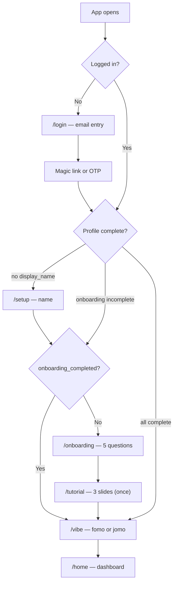
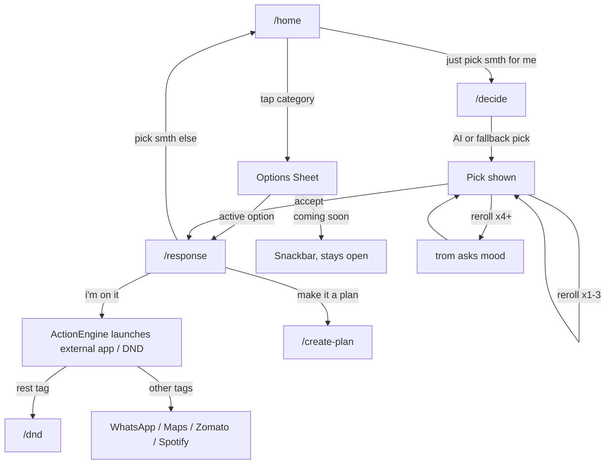
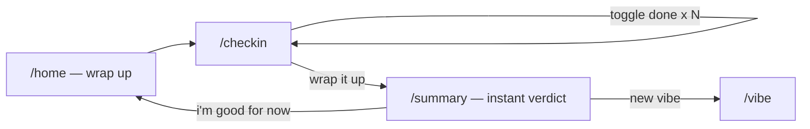
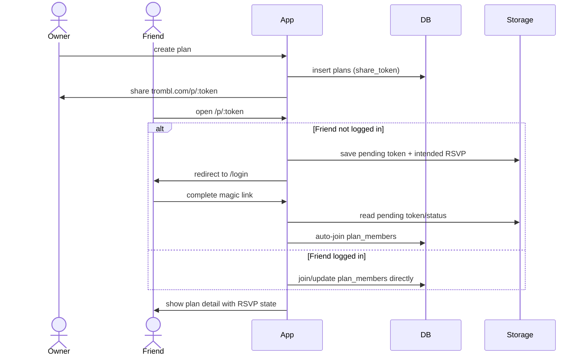
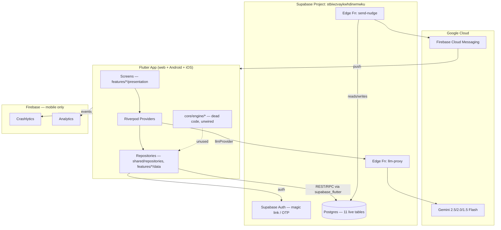
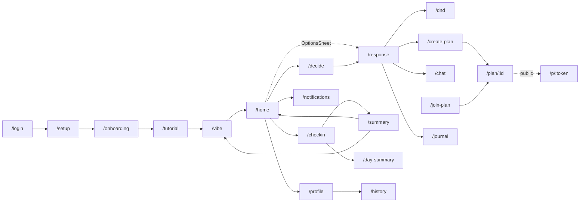
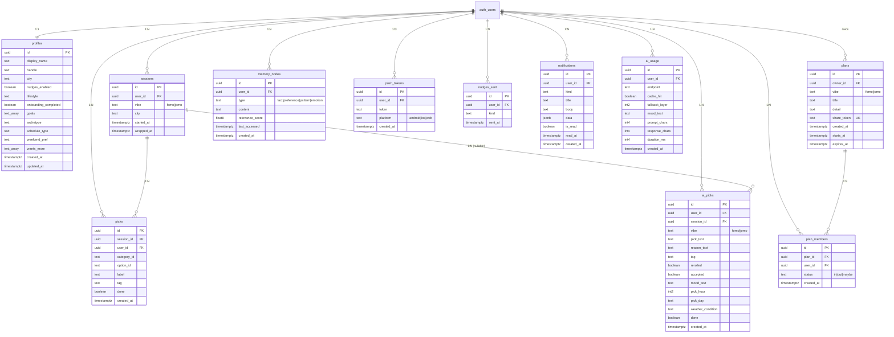

# trombl — Product Requirements Document

**Generated from a live codebase audit** of `trombl-app` (branch `mvp-static-categories`) and its backend (`trombl-backend`, Supabase project `stbiwzvaykwhdirwmwku`).
This document describes the product **as it currently exists in code** — not aspirational scope. Where the codebase is ambiguous, incomplete, or contradicts itself, that is called out explicitly rather than papered over.

| | |
|---|---|
| **App version** | `0.1.0+1` (pubspec) / `v1.0.1` (CLAUDE.md version map) |
| **Branch** | `mvp-static-categories` |
| **Platform** | Flutter (web primary, Android + iOS secondary) |
| **Backend** | Supabase (Postgres + Auth + Edge Functions), project `stbiwzvaykwhdirwmwku` |
| **AI** | Google Gemini, proxied server-side via `llm-proxy` edge function |
| **Push** | Firebase Cloud Messaging, via `send-nudge` edge function (native only — not web) |
| **Hosting** | Netlify (`main` → trombl.com, `development` → staging preview) |

---

# 1. Product Overview

## 1.1 Mission

Kill decision fatigue for Gen-Z users with a single vibe pick — **fomo** (go for it) or **jomo** (protect your peace) — then surface a curated, low-effort option and push the user to take one concrete action, voiced by **trom**, a chaotic-but-caring AI best-friend persona.

## 1.2 Vision

A daily habit loop where opening the app costs the user no thought: pick a vibe, get told what to do, do it, check in. Over time trom's "read" on the user (archetype, goals, accepted/rejected picks, memory nodes) makes suggestions feel personal rather than generic, without the user ever filling out a form beyond the one-time onboarding.

## 1.3 Problem Statement

Gen-Z users spend significant mental energy deciding what to do — tonight, this weekend, right now. The paradox of choice leads to doing nothing. Existing tools (Google, Instagram, event apps) require effort and amplify FOMO without resolving it. There is no lightweight, personality-first product that cuts through the noise and gives a push.

**Pain points addressed:**
- "I don't know what to do" paralysis
- Overthinking social plans until the moment passes
- Guilt around doing nothing (no JOMO permission)
- Coordinating plans with friends from scratch
- No one to tell you what to actually do *first*

## 1.4 Target Users

**Primary:** Gen-Z (18–26), smartphone-native, socially active, high decision fatigue, web + mobile users.

## 1.5 User Personas

These map directly to `profiles.archetype`, set during onboarding screen 2 and reinforced by `ArchetypeEngine`'s tag-scoring (+3 accept / -1 reject) — though that scoring engine itself is currently **dead code** (see §13).

| Persona | `archetype` value | Behaviour | What they need from trombl |
|---|---|---|---|
| **The Builder** | `builder` | Constantly starting projects, low follow-through | A direction, not more options |
| **The Social** | `social` | Wants plans, struggles to initiate | A pre-written squad text, momentum |
| **The Explorer** | `explorer` | Up for anything, decision paralysis from too much choice | A shortcut to *a* start, not *the best* start |
| **The Cozy** | `cozy` | Recharging intentionally, guilt about rest | Explicit permission to do nothing (JOMO) |
| **The Mix** | `mix` | Day-dependent mood | Fast fomo↔jomo switching, smart default suggestion |

## 1.6 Goals

1. Reduce time-to-action from "I don't know what to do" to first real step.
2. Build a daily habit loop — users return to pick a vibe.
3. Make AI content feel human (personality-first), not like a generic chatbot.
4. Enable lightweight social coordination (plans, squad texts) without a full social graph.

## 1.7 Non-Goals

Explicitly out of scope for the current build (per `CLAUDE.md` and code state):

| Non-goal | Evidence |
|---|---|
| Full conversational AI chat | `/chat` is a local-only stub with a seeded opener; no AI response loop, no persistence |
| Dynamic AI-generated menu categories | `DynamicMenuNotifier`/`dynamicMenuProvider` exist but are explicitly parked per `CLAUDE.md`; `/menu` route unused in this branch |
| The "v2" recommendation/archetype/memory-penalty engine | `RecommendationEngine`, `ArchetypeEngine`, `MemoryEngine`, `V2Repository` exist in `lib/core/engine/` and `lib/shared/repositories/v2_repository.dart` but are **not imported by any screen or provider** — confirmed dead code, querying tables (`open_loops`, `recommendation_log`, `action_history`) that don't exist in the live database |
| Social discovery / location-based meetups ("Drift") | An entire second schema + 6 edge functions exist in the backend repo's migrations but were **never deployed** to the live project |
| Push notifications on web | Explicitly documented in README — FCM service worker conflicts with Flutter web's own SW |
| Payments / monetisation | No billing code anywhere in the repo |
| Accessibility (screen readers, dynamic type, contrast modes) | No semantics labels, no accessibility testing found |
| Localization | All copy is hardcoded lowercase English strings; no `intl`/ARB setup |

## 1.8 Success Metrics (MVP targets, from CLAUDE.md / project history)

| Metric | Target |
|---|---|
| D1 retention | > 40% |
| Daily vibe picks per active user | ≥ 1 |
| Option → action conversion ("i'm on it" tapped) | > 50% |
| Check-in completion rate (session wrapped) | > 30% |
| AI reaction load success rate | > 95% (counting fallback as success — never shows an error state) |

## 1.9 KPIs (ongoing health, derived from instrumented analytics events)

These are measurable today because the events already fire (`AnalyticsService`):

| KPI | Source event(s) |
|---|---|
| Activation rate | `login` → `onboarding_completed` → `vibe_picked` |
| Engagement depth | `category_opened` → `option_selected` ratio (browse vs. act) |
| AI reliance vs. fallback rate | `ai_usage.fallback_layer` distribution (1 = live Gemini, 2 = cache, 3 = static fallback) |
| Action completion | `action_launched` → `session_wrapped` with `done_picks/total_picks` |
| Social loop adoption | `plan_created` → `plan_joined` |
| Notification health | `notification_permission_granted` rate; `nudges_sent` vs. `notifications.is_read` |

---

# 2. Product Features

For each feature: Purpose, User Story, Acceptance Criteria, Business Rules, Edge Cases, Future Improvements, Dependencies.

## 2.1 Authentication (magic link + OTP)

- **Purpose:** Passwordless sign-in; no password ever stored or handled client-side.
- **User Story:** As a new user, I enter my email and get into the app without creating a password.
- **Acceptance Criteria:**
  - Email submitted → Supabase sends magic link (primary) and/or 8-digit OTP (fallback, gated by `FeatureFlags.emailConfirmationEnabled`).
  - OTP auto-verifies on 8th digit typed; 30s resend cooldown.
  - On success, `authStateProvider` fires → router redirects based on profile completeness.
- **Business Rules:** Post-auth routing precedence — no `display_name` → `/setup`; `onboarding_completed=false` → `/onboarding`; pending plan token in storage → `/p/:token`; else → `/vibe`.
- **Edge Cases:** Magic-link click on a cold app instance (deep link) must restore `pendingPlanTokenProvider` from `SharedPreferences` before redirecting. Debug builds expose a password-login shortcut (`kDebugMode` only) that bypasses the magic-link round trip.
- **Future Improvements:** Social login (Google/Apple) not present.
- **Dependencies:** Supabase Auth, `currentUserProvider`, `authStateProvider`, `pendingPlanTokenProvider`.

## 2.2 Onboarding Questionnaire

- **Purpose:** Cheap personalization signal collected once, feeding AI prompt context.
- **User Story:** As a new user, I answer 5 quick questions so trom's picks feel relevant to me.
- **Acceptance Criteria:** 5 screens (goals multi-select, archetype single-select, schedule single-select, weekend pref single-select, wants-more multi-select) → writes to `profiles` → routes to `/tutorial`.
- **Business Rules:** "skip all" available on screens 1–4. Save failure is **non-fatal** — user proceeds regardless (never blocks on a write failure).
- **Edge Cases:** Partial completion (closing app mid-flow) leaves `onboarding_completed=false`, so the user re-enters onboarding next session — answers already given aren't resumed/merged.
- **Future Improvements:** No resume-from-partial state.
- **Dependencies:** `sessionRepositoryProvider.saveOnboardingData()`, `profiles` table.

## 2.3 Tutorial (one-time)

- **Purpose:** Explain fomo/jomo and trom's personality without a wall of text.
- **User Story:** As a first-time user, I see 3 swipeable slides before I'm asked to do anything.
- **Acceptance Criteria:** Shown once, gated by `SharedPreferences` key `tutorial_shown`; never shown again.
- **Business Rules:** Skip button on all but the last slide.
- **Edge Cases:** Clearing app storage resets the flag and the tutorial reappears.
- **Dependencies:** `SharedPreferences` only — no backend write.

## 2.4 Vibe Picker (daily entry point)

- **Purpose:** Force a single binary mood choice before showing any options, reducing the decision space immediately.
- **User Story:** As a returning user, I tell trom whether I want to go for it or protect my peace today.
- **Acceptance Criteria:** Tapping fomo/jomo creates or restores today's `sessions` row, then routes to `/home`.
- **Business Rules:** Time-of-day smart suggestion (0–9h → jomo, Fri/Sat evening 18–24h → fomo, else → fomo) shown as a "trom rn" badge. If a session for today already exists, it's restored silently; tapping the other vibe calls `switchVibe()`.
- **Edge Cases:** Optional city chip (bottom-sheet text input) is purely advisory context for AI/weather — no geocoding/validation.
- **Dependencies:** `activeSessionProvider`, `sessionRestoredProvider`, `cityProvider`, `sessions` table.

## 2.5 Home Dashboard

- **Purpose:** Single-screen hub for the day's loop: pick a category, ask trom, see plans/activity.
- **User Story:** As a user with an active session, I see my 4 vibe-appropriate categories and can either browse or let trom pick for me.
- **Acceptance Criteria:** Renders greeting, 4 static categories (`TromblMenu.core(vibe)`), mood input + "just pick smth for me" CTA, plans list, activity bottom sheet, notification bell with unread badge.
- **Business Rules:** No active session → redirect to `/vibe` (post-frame callback, not a router-level redirect).
- **Edge Cases:** Empty states handled independently per zone (no plans ≠ no activity ≠ hide whole screen).
- **Dependencies:** `homeGreetingProvider`, `myPlansProvider`, `unreadNotificationCountProvider`, `TromblMenu.core()`.

## 2.6 Options Sheet (static menu browsing)

- **Purpose:** Let the user browse curated options within a category instead of trusting AI.
- **User Story:** As a user, I tap a category and pick a specific thing to do from a short list.
- **Acceptance Criteria:** Active options → `/response` with `ResponseArgs`. "Coming soon" options → snackbar, no navigation.
- **Business Rules:** 16 of the static menu's options across both vibes are tagged `comingSoon` and intentionally non-functional in this branch.
- **Edge Cases:** None beyond the coming-soon short-circuit.
- **Dependencies:** `menu_data.dart` (static content), `AnalyticsService.categoryOpened/optionSelected/comingSoonTapped`.

## 2.7 Decide (AI Pick Engine)

- **Purpose:** Remove choice entirely — trom picks for the user, with a 4-layer reliability fallback so it never visibly fails.
- **User Story:** As a user who doesn't even want to browse, I tap one button and get told what to do.
- **Acceptance Criteria:** Fork → Loading → Pick (reroll/accept) → Ask (after 3 rerolls) state machine; every AI call logged to `ai_usage`.
- **Business Rules:**
  1. Live Gemini call via `llm-proxy` with full context (vibe, hour, day, city, weather, archetype, goals, schedule, reject-list, mood text).
  2. If response contains banned/generic phrases → one retry with a "be more specific" instruction.
  3. If the call still fails → static, time-aware fallback (`PickFallback`) — never an error screen.
  4. After 3 rerolls, trom asks a clarifying mood question before trying again.
- **Edge Cases:** Rejected picks within the session are excluded from subsequent prompts (in-memory reject list, not persisted beyond the session).
- **Future Improvements:** The dead "v2" `RecommendationEngine`/`ArchetypeEngine` pipeline appears to be an abandoned attempt to replace this exact flow with scored candidates instead of a single LLM call — worth either reviving or deleting.
- **Dependencies:** `llmProvider` → `ProxyLlmProvider` → `llm-proxy` edge function (Gemini), `decideRepositoryProvider`, `aiUsageServiceProvider`.

## 2.8 Response Screen (reaction + first step + action)

- **Purpose:** Make the chosen action feel personal and lower the activation barrier to zero.
- **User Story:** As a user who just picked something, I want trom to react to it and tell me literally the first physical thing to do.
- **Acceptance Criteria:** Shows AI reaction (`reactionProvider`, with static fallback), a rule-based "do this first" line keyed by tag, and (for `squad` tag + AI-available) a pre-written WhatsApp draft.
- **Business Rules:** Action routing by tag — `squad`→WhatsApp/IG DM, `discover`→Maps/search, `order in`→Zomato/Swiggy, `rest`→`/dnd`, `content`→Notes/Spotify, `comingSoon`→snackbar.
- **Edge Cases:** Post-launch affirmation buttons ("fr did it" / "nah") mark the pick done directly from this screen, separate from the end-of-day check-in.
- **Dependencies:** `ActionEngine`/`ActionLauncher`, `reactionProvider`, `memory_nodes` (optional save-a-preference prompt).

## 2.9 DnD Screen

- **Purpose:** Give jomo picks a clean, guilt-free completion state instead of forcing a check-in.
- **User Story:** As a user who picked "rest," I want confirmation that doing nothing *is* the completed action.
- **Acceptance Criteria:** Static screen, single CTA back to `/home`.
- **Dependencies:** None — `StatelessWidget`.

## 2.10 Check-in + Day Summary + Summary

- **Purpose:** Close the daily loop with a lightweight, honest reflection — no AI needed for the verdict.
- **User Story:** As a user ending my day, I mark what I actually did and get a one-line reactive verdict.
- **Acceptance Criteria:** `/checkin` toggles `picks.done`; "wrap it up" requires ≥1 done pick; routes to `/summary` with done/total counts; `/summary` shows hardcoded verdict copy by ratio (all/none/some done) — instant, no network call.
- **Business Rules:** `/day-summary` (LLM 2-line narrative) is a separate, older route still reachable but not the primary flow — `/summary` is the active path per CLAUDE.md.
- **Edge Cases:** Empty state ("u haven't picked anything yet") when no picks exist for the session.
- **Dependencies:** `checkinPicksProvider`, `sessions.wrapped_at`, `picks.done`.

## 2.11 Plans (create / landing / detail / join)

- **Purpose:** Lightweight social coordination without requiring the invitee to already have the app or an account.
- **User Story:** As a user with a plan, I want to share one link and have friends RSVP without friction.
- **Acceptance Criteria:** `/create-plan` generates a `share_token` and a `trombl.com/p/:token` URL; `/p/:token` is public (no auth required) and supports in/out/maybe RSVP; unauthenticated RSVP intent is persisted (`PendingJoinService` + `pendingPlanTokenProvider`/`pendingPlanStatusProvider`) and auto-completed after login.
- **Business Rules:** Plan owner can edit/delete; non-owners can change their own RSVP only.
- **Edge Cases:** `plans.expires_at` is set on creation (7-day TTL per existing PRD) but there's no enforcement/auto-archive job — expired plans remain joinable.
- **Future Improvements:** Custom time picker for plans is blocked on a DB migration (per CLAUDE.md note).
- **Dependencies:** `planRepositoryProvider`/`FeaturePlanRepository`, `plans`/`plan_members` tables, `share_plus`.

## 2.12 History

- **Purpose:** Let users see their own pattern of vibe picks and follow-through over time.
- **User Story:** As a user, I want to scroll back through my last 30 days and see what I actually did.
- **Acceptance Criteria:** Stats row (days active, fomo/jomo split, done rate) + chronological wrapped-session list.
- **Edge Cases:** Only *wrapped* sessions are shown — an active, un-checked-in session is invisible here.
- **Dependencies:** `sessionRepositoryProvider.recentSessions()/picksForSessions()`.

## 2.13 Profile

- **Purpose:** "Trom's read on you" — identity + derived stats + AI pattern read + memory.
- **User Story:** As a user, I want to see what trom has picked up about me.
- **Acceptance Criteria:** Display name/handle/city (editable), stats (days active, picks done/total), recent wins, memory nodes, recent wrapped sessions, sign-out.
- **Dependencies:** `_tromsReadDataProvider`, `_currentProfileProvider`, `memory_nodes` table.

## 2.14 In-App Notification Center *(added this session)*

- **Purpose:** Persist a record of every nudge sent so users see it in-app even without push permission or a registered device.
- **User Story:** As a user, I want to see what trom nudged me about, even if I missed the push.
- **Acceptance Criteria:** Bell icon with unread-count badge on Home; `/notifications` lists all rows from `notifications`, newest first; tap marks read; "mark all read" bulk action.
- **Business Rules:** `send-nudge` inserts a `notifications` row for every non-rate-limited nudge **regardless of FCM delivery outcome** — so users without a push token still get the in-app record.
- **Edge Cases:** Rate-limited nudges (same `kind` to same user within 24h) produce **no** notification row at all.
- **Dependencies:** `notifications` table (new, see §6), `notificationRepositoryProvider`, `send-nudge` edge function v7.

## 2.15 Chat (stub)

- **Purpose:** Placeholder conversational surface for a future full AI chat loop.
- **User Story:** N/A — not a complete feature yet.
- **Acceptance Criteria:** Opens with a seeded trom message (`ChatArgs.seedText`); user can type replies; **no AI response, no persistence** — local state only, lost on navigation away.
- **Future Improvements:** Full AI response loop is an explicit future milestone (README).
- **Dependencies:** None (no providers, no Supabase calls).

## 2.16 Journal

- **Purpose:** Free-form reflection capture, stored as a `memory_nodes` row of type `emotion`.
- **User Story:** As a user, I want to dump my thoughts somewhere trom remembers.
- **Acceptance Criteria:** Multiline text field → save → routes to `/home`.
- **Known Gap:** Has a TODO (see §13) — entries aren't surfaced anywhere; the profile screen doesn't list past journal entries.
- **Dependencies:** `sessionRepositoryProvider.saveMemoryNode()`.

## 2.17 Push Notifications (infrastructure)

- **Purpose:** Re-engagement via daily local reminders (10am/8pm) and server-triggered nudges (e.g. drift-match-style events, though those triggers aren't wired to any live feature today).
- **User Story:** As a user, I get nudged back into the app without checking it manually.
- **Acceptance Criteria:** On sign-in: request permission → register FCM token → schedule daily reminders. On sign-out: unregister tokens, cancel all local notifications.
- **Business Rules:** Not available on web (FCM service-worker conflict). `send-nudge` rate-limits by `(user_id, kind)` to once per 24h.
- **Dependencies:** `firebase_messaging`, `flutter_local_notifications`, `push_tokens`/`nudges_sent`/`notifications` tables, `send-nudge` edge function.

---

# 3. Complete User Flow

## 3.1 Signup → Onboarding → Dashboard



## 3.2 Decision Flow (core daily loop)



## 3.3 End-of-day flow



## 3.4 Plan share / deep link flow



## 3.5 Settings

There is no dedicated `/settings` route. Settings are inline on `/profile` (edit name/handle/city via a bottom sheet) — there is no notification-preference toggle, no account-deletion flow, and no privacy controls in the UI, despite `profiles.nudges_enabled` existing as a column.

## 3.6 Notifications

Covered in §2.14 and §2.17. Flow: `send-nudge` (server) → `notifications` row (always, if not rate-limited) + FCM push (if device token exists) → bell badge on Home → `/notifications` list → mark read.

## 3.7 Premium

**Does not exist.** No subscription, paywall, entitlement check, or payment SDK anywhere in the codebase.

## 3.8 Logout

`/profile` → sign-out action → `Supabase.auth.signOut()` → `authStateProvider` fires → `unregisterTokens()` + `cancelAll()` (notifications) → router redirect guard sends user to `/login`.

---

# 4. Screen Inventory

22 top-level screens across 13 feature folders.

### Onboarding

| Screen | File | Purpose | Inputs | Outputs | Providers | Tables |
|---|---|---|---|---|---|---|
| **LoginScreen** | `features/onboarding/presentation/login_screen.dart` | Email/OTP/magic-link entry | email, OTP digits | `auth.signInWithOtp/verifyOTP` | `supabaseProvider`, `sessionRepositoryProvider`, `pendingPlanTokenProvider` | `profiles` (upsert) |
| **SetupScreen** | `.../setup_screen.dart` | Collect display name | name text field | profile update | `sessionRepositoryProvider`, `pendingPlanTokenProvider` | `profiles` |
| **OnboardingScreen** | `.../onboarding_screen.dart` | 5-step questionnaire | multi/single-select answers | `saveOnboardingData()` | `sessionRepositoryProvider` | `profiles` |
| **TutorialScreen** | `.../tutorial_screen.dart` | 3-slide explainer (once) | swipe/skip | `SharedPreferences` flag | none | — |

### Core loop

| Screen | File | Purpose | Inputs | Outputs | Providers | Tables |
|---|---|---|---|---|---|---|
| **VibeScreen** | `features/vibe/presentation/vibe_screen.dart` | Daily fomo/jomo gate | vibe tap, city sheet | session start/switch | `activeSessionProvider`, `cityProvider`, `onboardingCompletedProvider` | `sessions`, `profiles` |
| **HomeScreen** | `features/home/presentation/home_screen.dart` | Main dashboard | mood text, category/decide/notif/profile taps | navigation, mood state | `homeGreetingProvider`, `myPlansProvider`, `unreadNotificationCountProvider` | `sessions`, `profiles`, `ai_picks`, `picks`, `plans` |
| **MenuScreen** | `features/menu/presentation/menu_screen.dart` | Full-screen category browse (alt to Home) — **unused in this branch** | category/plan taps | navigation | `activeSessionProvider`, `todayPickCountProvider`, `myPlansProvider` | `sessions`, `plans` |
| **DecideScreen** | `features/decide/presentation/decide_screen.dart` | AI pick state machine | pick/reroll/explore/mood taps | `ai_picks` writes, action launch | `llmProvider`, `decideRepositoryProvider`, `aiUsageServiceProvider` | `ai_picks`, `memory_nodes` |
| **ResponseScreen** | `features/response/presentation/response_screen.dart` | Reaction + first step + action | CTA taps, memory text | external launches, pick-done, memory save | `reactionProvider`, `sessionRepositoryProvider` | `memory_nodes`, picks/ai_picks done flag |
| **DndScreen** | `features/response/presentation/dnd_screen.dart` | Rest confirmation | back tap | navigation only | none | — |
| **CheckinScreen** | `features/checkin/presentation/checkin_screen.dart` | Toggle picks done, wrap day | checkbox toggles, wrap button | `picks.done`, `sessions.wrapped_at` | `checkinPicksProvider` | `picks`, `sessions` |
| **DaySummaryScreen** | `features/checkin/presentation/day_summary_screen.dart` | LLM day narrative (legacy path) | none (args-driven) | session clear | `daySummaryProvider`, `streakProvider` | reads sessions/picks |
| **SummaryScreen** | `features/summary/presentation/summary_screen.dart` | Instant hardcoded verdict | CTA taps | navigation, session clear | `activeSessionProvider` | — |
| **ProfileScreen** | `features/profile/presentation/profile_screen.dart` | Identity + stats + AI read + memory | edit-profile sheet, sign-out | profile update, sign-out | `_tromsReadDataProvider`, `_currentProfileProvider`, `myPlansProvider` | `profiles`, `sessions`, `ai_picks`, `memory_nodes`, `plans` |

### Plans

| Screen | File | Purpose | Inputs | Outputs | Providers | Tables |
|---|---|---|---|---|---|---|
| **PlanLandingScreen** | `features/plan/presentation/plan_landing_screen.dart` | Public RSVP page (`/p/:token`) | RSVP taps | `plan_members` join, pending-intent storage | `featurePlanRepoProvider`, `currentUserProvider` | `plans`, `plan_members`, `profiles` |
| **CreatePlanScreen** | `features/plan/presentation/create_plan_screen.dart` | Create + share a plan | title/detail text, time chips | `plans` insert, share sheet | `planRepositoryProvider` | `plans` |
| **PlanDetailScreen** | `features/plans/presentation/plan_detail_screen.dart` | Full plan + member RSVPs | RSVP/delete/leave taps | `plan_members` update, `plans` delete | `planDetailProvider`, `planMembersProvider`, `rsvpProvider` | `plans`, `plan_members`, `profiles` |
| **JoinPlanScreen** | `features/plans/presentation/join_plan_screen.dart` | Paste-a-code join | token text field | `plan_members` join | `planRepositoryProvider`, `myPlansProvider` | `plans`, `plan_members` |

### Utilities

| Screen | File | Purpose | Inputs | Outputs | Providers | Tables |
|---|---|---|---|---|---|---|
| **HistoryScreen** | `features/history/presentation/history_screen.dart` | 30-day wrapped session history | back tap | none (read-only) | local `_historyProvider` | `sessions`, `picks` |
| **ChatScreen** | `features/chat/presentation/chat_screen.dart` | Stub chat thread | text input | local list only — **no persistence** | none | — |
| **JournalScreen** | `features/journal/presentation/journal_screen.dart` | Free-text reflection | multiline text | `memory_nodes` insert | `sessionRepositoryProvider` | `memory_nodes` |
| **NotificationCenterScreen** | `features/notifications/presentation/notification_center_screen.dart` | Notification inbox | mark-read taps | `notifications.is_read` update | `notificationsProvider`, `notificationRepositoryProvider` | `notifications` |

---

# 5. Technical Architecture

## 5.1 High-level architecture



## 5.2 Folder structure

```
lib/
  core/
    ai/                  LLM abstraction — llm_provider.dart (interface),
                          providers/proxy_llm_provider.dart (impl), system_prompts.dart,
                          ai_usage_service.dart (fire-and-forget logger)
    config/               feature_flags.dart (1 active flag)
    design_system/        spacing.dart (4pt grid constants)
    engine/               UNUSED v2 recommendation pipeline (recommendation/, scoring/,
                          memory/, archetype/, context/, open_loops/, action/, jomo/, fomo/)
    notifications/        notification_service.dart (FCM + local reminders)
    observability/        analytics_service.dart, crash_service.dart
    router/                app_router.dart (auth-aware GoRouter)
    services/              weather_service.dart, pending_join_service.dart
    theme/                trombl_theme.dart (TromblColors/TromblText design tokens)
    app_config.dart        --dart-define env reader
    providers.dart          root providers (supabase client, auth, LLM, mood input)
  features/
    onboarding/   login, setup, onboarding questionnaire, tutorial
    vibe/         fomo/jomo picker + session lifecycle
    home/         main dashboard
    menu/         static + (unused) dynamic category browse, action engine
    decide/       AI pick engine
    response/     reaction + first-step + action + dnd
    checkin/      end-of-day toggle + day summary
    summary/      instant verdict screen
    plan/         create + public landing page
    plans/        detail + join (shared plan logic, separate folder from `plan/`)
    profile/      identity + AI read + memory
    history/      30-day session log
    chat/         stub
    journal/      free-text memory capture
    notifications/  in-app notification center (added this session)
  shared/
    models/        Freezed models mirroring DB tables (models.dart + generated .freezed/.g)
    repositories/   session_repository.dart, plan_repository.dart, v2_repository.dart (unused)
    result.dart     typed Result<T> with trom-voice error copy
```

## 5.3 Riverpod providers (47 total)

Grouped by domain — full method-level detail lives in the repositories below.

| Domain | Providers |
|---|---|
| **Root/auth** | `supabaseProvider`, `authStateProvider`, `currentUserProvider`, `pendingPlanTokenProvider`, `pendingPlanStatusProvider` |
| **AI** | `llmProvider`, `aiUsageServiceProvider`, `moodInputProvider`, `decideShouldAutoStartProvider` |
| **Session/vibe** | `sessionRepositoryProvider`, `activeSessionProvider`, `sessionRestoredProvider`, `streakProvider`, `cityProvider` |
| **Home** | `homeGreetingProvider` |
| **Decide** | `decideRepositoryProvider` |
| **Checkin** | `checkinPicksProvider`, `todayPickCountProvider`, `daySummaryProvider` |
| **Menu (unused path)** | `menuMoodProvider`, `activePickProvider`, `menuCacheKeyProvider`, `menuCacheServiceProvider`, `menuRepositoryProvider`, `dynamicMenuProvider` |
| **Response** | `reactionProvider` |
| **Plans (feature)** | `featurePlanRepoProvider` |
| **Plans (shared)** | `planRepositoryProvider`, `myPlansProvider`, `planDetailProvider`, `planMembersProvider`, `myMembershipProvider`, `memberProfilesProvider`, `currentProfileProvider`, `planOwnerProfileProvider`, `planInCountProvider`, `rsvpProvider`, `cancelPlanProvider` |
| **Notifications** | `notificationRepositoryProvider`, `notificationsProvider`, `unreadNotificationCountProvider` |

**DI pattern:** every repository takes a `SupabaseClient` (sourced from `supabaseProvider`) via constructor injection; feature providers compose repository providers (e.g. `decideRepositoryProvider` depends on both `supabaseProvider` and `sessionRepositoryProvider`). No service locator, no global singletons for data access — singletons are used only for cross-cutting services (`NotificationService`, `AnalyticsService`, `CrashService`).

## 5.4 Repositories

| Repository | File | Tables touched |
|---|---|---|
| `SessionRepository` | `shared/repositories/session_repository.dart` | `sessions`, `picks`, `profiles`, `memory_nodes` |
| `V2Repository` *(unused)* | `shared/repositories/v2_repository.dart` | `open_loops`, `recommendation_log`, `action_history` — **none of these tables exist in the live database** |
| `PlanRepository` | `shared/repositories/plan_repository.dart` | `plans`, `plan_members` |
| `DecideRepository` | `features/decide/data/decide_repository.dart` | `ai_picks` |
| `FeaturePlanRepository` | `features/plan/data/plan_repository.dart` | `plans`, `plan_members`, `profiles` |
| `MenuRepository` *(unused path)* | `features/menu/data/menu_repository.dart` | none — LLM + cache only |
| `NotificationRepository` | `features/notifications/data/notification_repository.dart` | `notifications` |

## 5.5 Services

| Service | Purpose |
|---|---|
| `AiUsageService` | Fire-and-forget logger for every Gemini call → `ai_usage` |
| `NotificationService` | FCM token lifecycle + local daily reminders (10am/8pm, Asia/Kolkata) |
| `WeatherService` | Open-Meteo lookup (no key required), feeds AI context only — never shown in UI |
| `PendingJoinService` | Persists plan-join intent across the magic-link app restart |
| `AnalyticsService` | Firebase Analytics wrapper, disabled in `kDebugMode` |
| `CrashService` | Firebase Crashlytics wrapper, wires `FlutterError.onError` + `runZonedGuarded` |

## 5.6 Firebase integration

- **Init:** mobile-only (web build skips Firebase entirely), wrapped in try/catch so a missing `google-services.json`/`GoogleService-Info.plist` doesn't crash boot.
- **Analytics:** 16 distinct events fired (see §1.9 + screen list); disabled in debug builds.
- **Crashlytics:** non-fatal + fatal recording; user ID attached on sign-in.
- **Messaging:** token registration, foreground/background handlers, daily local reminders — see §2.17.
- **No Sentry, no Remote Config** (a `// Future:` comment in `feature_flags.dart` notes Remote Config as a planned replacement for the static flag file).

## 5.7 Supabase integration

- Client initialized once in `main()` from `--dart-define` values (`AppConfig`); hard failure (`_ConfigErrorApp`) if either `SUPABASE_URL` or `SUPABASE_ANON_KEY` is missing — no silent fallback.
- Auth: magic link (primary) + OTP (fallback, flag-gated).
- Postgres: 11 live tables (§6), all RLS-enabled.
- Edge Functions: `llm-proxy`, `send-nudge` (only two deployed; see §7).
- Realtime: not used by the live app (Realtime publication exists only for the unused Drift schema).

## 5.8 REST APIs

See full documentation in §7. Two edge functions total; all other data access is direct `supabase_flutter` table queries from repositories (no app-owned REST layer).

## 5.9 Navigation

GoRouter, auth-aware via a single `redirect` callback plus an `_AuthRefresh` `ChangeNotifier` bridging `authStateProvider` → router refresh.



Public route (bypasses login guard): `/p/:token`. Every other route requires `currentUserProvider != null`.

## 5.10 Storage & caching

| Mechanism | Used for |
|---|---|
| `SharedPreferences` | `tutorial_shown`, `pending_plan_token`, `pending_plan_status`, `trombl_memory_v1` (unused engine), `trombl_menu_v1_*` (unused dynamic-menu cache) |
| Postgres | System of record for everything else |
| No Hive/SQLite/Drift(local) | — |

## 5.11 Notifications

See §2.17 — covers both local scheduled reminders and server-triggered FCM via `send-nudge`.

## 5.12 Analytics

16 events, Firebase Analytics, disabled in debug. See §1.9 and screen-by-screen mentions in §2/§4.

## 5.13 Crash reporting

Firebase Crashlytics only, mobile-only, debug-disabled. No web crash reporting exists.

---

# 6. Database Documentation

**Important scope note:** these 11 tables are the **live, deployed schema** on project `stbiwzvaykwhdirwmwku` (verified directly against the running database). A second, much larger schema (`trombl_profiles`, `trombl_push_tokens`, `trombl_notifications`, `drift_*` — 20+ tables) exists in the backend repo's migration files (`00003`–`00012`) but **was never deployed** and belongs to an unrelated, unbuilt "Drift" social-discovery feature. Do not confuse the two — see §13 for why this is a documentation risk.

## 6.1 ER Diagram (live schema)



## 6.2 Table-by-table detail

| Table | Purpose | Indexes | RLS |
|---|---|---|---|
| `profiles` | One row per user, identity + onboarding signal + AI prompt context | PK on `id` | RLS enabled (verified) — exact policy SQL **not in version control**; inferred own-row read/update from app behavior |
| `sessions` | One row per vibe-pick day | PK on `id` | RLS enabled — policy SQL not in version control |
| `picks` | Static-menu options chosen within a session | PK; FK→`sessions`, FK→`auth.users` | RLS enabled — not in version control |
| `ai_picks` | AI-generated picks (Decide flow) | PK; FK→`sessions` (nullable), FK→`auth.users` | RLS enabled — not in version control |
| `plans` | Shareable plan, has a public `share_token` | PK; unique on `share_token` | RLS enabled — must allow unauthenticated SELECT by token for `/p/:token` to work; not in version control |
| `plan_members` | RSVP per user per plan | PK; FK→`plans`, FK→`auth.users` | RLS enabled — not in version control |
| `memory_nodes` | AI's persisted observations about a user | PK; FK→`auth.users` | RLS enabled — not in version control |
| `ai_usage` | Telemetry for every LLM call | PK; FK→`auth.users` (nullable) | RLS enabled — not in version control |
| `push_tokens` | FCM device tokens | PK; FK→`auth.users` | RLS enabled — not in version control |
| `nudges_sent` | 24h rate-limit log for `send-nudge` | PK; FK→`auth.users` | RLS enabled — not in version control |
| `notifications` | In-app notification center (added this session) | PK; `notifications_user_idx (user_id, created_at desc)`; FK→`auth.users` | **Documented in [00016_notifications_table.sql](../../trombl-backend/backend/supabase/migrations/00016_notifications_table.sql):** own-row SELECT/UPDATE/DELETE only; no client INSERT policy (service-role only, via `send-nudge`) |

## 6.3 Relationships

- `auth.users` (Supabase-managed) is the root of every table.
- `sessions` is the join point between daily vibe state and both pick types (`picks`, `ai_picks`).
- `plans`/`plan_members` form a standard owner/membership pair, with `plans` uniquely indexed on `share_token` to support the public landing page.
- `push_tokens` → `nudges_sent` → `notifications` form the send-nudge pipeline: token lookup → rate-limit check → persisted record → (optional) FCM send.

---

# 7. API Documentation

Two Supabase Edge Functions are deployed to production. Everything else is direct Postgres access via `supabase_flutter`, which is not separately documented here since it has no fixed request/response contract — see §6 for table shapes and §5.4 for repository methods instead.

## 7.1 `llm-proxy`

| | |
|---|---|
| **Method** | POST |
| **Auth** | Supabase JWT (`verify_jwt: true`) |
| **Purpose** | Provider-agnostic proxy to Google Gemini; the app never holds an LLM API key |

**Request:**
```json
{ "system": "string — persona/system prompt", "prompt": "string — user prompt" }
```

**Response (200, always — never propagates a hard error to the client):**
```json
{ "text": "string — generated text, or empty string on total failure" }
```

**Model fallback chain:** `gemini-2.5-flash` (env override) → `gemini-2.0-flash` → `gemini-1.5-flash`. `thinkingBudget: 0`, `maxOutputTokens: 300`, `temperature: 0.9`.

**Error handling:**
| Condition | Behavior |
|---|---|
| 429 (quota) or 404 (model not found) | Try next model in chain |
| 400 / 401 / 500 from Gemini | No retry, log, return `{ "text": "" }` |
| Response parse failure | Return `{ "text": "" }` |
| Missing `GEMINI_API_KEY` secret | Return `{ "text": "" }` |

This fail-soft design is why the app never shows an AI error state (§2.7, §2.8) — every caller treats an empty string as "fall back to static copy."

## 7.2 `send-nudge`

| | |
|---|---|
| **Method** | POST |
| **Auth** | `verify_jwt: false` — relies on server-side service-role key internally; **callable by anyone who has the function URL**, no per-caller auth check on the request itself |
| **Purpose** | Send an FCM push + persist an in-app notification, rate-limited per `(user_id, kind)` |

**Request:**
```json
{
  "user_id": "uuid",
  "kind": "string — e.g. check_in_reminder",
  "title": "string",
  "body": "string",
  "data": { "...": "..." }
}
```

**Responses:**

| Case | Status | Body |
|---|---|---|
| Missing required field | 400 | `{ "error": "user_id, kind, title, body are required" }` |
| Invalid JSON | 400 | `{ "error": "invalid JSON body" }` |
| Rate-limited (same kind, same user, <24h) | 200 | `{ "skipped": "rate_limited" }` — **no notification row created** |
| Missing Firebase secrets | 500 | `{ "error": "FIREBASE_PROJECT_ID/CLIENT_EMAIL/PRIVATE_KEY not configured" }` |
| Notification insert fails | 500 | `{ "error": "notification insert failed: ..." }` |
| Success | 200 | `{ "sent": N, "failed": N, "total_tokens": N, "errors": [...] }` |
| No device tokens registered | 200 | `{ "sent": 0, "failed": 0, "total_tokens": 0 }` — in-app notification still created |

**Auth internals:** Firebase access token obtained via RS256-signed JWT (service account: `FIREBASE_PROJECT_ID`/`FIREBASE_CLIENT_EMAIL`/`FIREBASE_PRIVATE_KEY` secrets), exchanged for an OAuth2 bearer token, cached until 5 minutes before expiry.

**Side effects:** deletes any `push_tokens` row FCM reports as `UNREGISTERED`/`NOT_FOUND`/404.

## 7.3 Undeployed functions (source exists, not live)

`drift-create-session`, `drift-discover-nearby`, `drift-match-users`, `drift-contact-reveal`, `drift-publish-story`, `drift-report-user` — all part of the unused Drift schema (§6 note). Not documented further since they are not part of the live product.

---

# 8. Functional Requirements

1. Users must be able to authenticate without setting a password.
2. Onboarding must collect goals/archetype/schedule/weekend-pref/wants-more in ≤5 screens, with a skip path.
3. The system must offer exactly two daily vibes (fomo/jomo); switching must update the active session.
4. Every category must surface either a static option list or (for `comingSoon` items) an explicit non-functional state — never a silent no-op.
5. The AI pick flow must never surface a raw error to the user; it must degrade through retry → static fallback → clarifying question.
6. Every accepted action must route to either an external app/URL or an in-app terminal screen (`/dnd`).
7. End-of-day check-in must allow marking individual picks done/not-done and must compute a verdict without a network call.
8. A plan must be joinable via a public link without requiring prior sign-in, with RSVP intent surviving the login round-trip.
9. Every server-sent nudge must be persisted as an in-app notification regardless of push delivery success, unless rate-limited.
10. Every LLM call must be logged with latency, token counts, and which fallback layer fired.

---

# 9. Non-Functional Requirements

## 9.1 Performance
- AI reaction load target: < 2s, with fallback shown if exceeded (no enforced client-side timeout found in code — this is a documented target, not an implemented SLA).
- `MenuRepository` (unused path) implements a 3-tier cache (memory → disk → LLM) specifically to keep menu generation off the network path; this pattern is not used by the live Decide flow, which calls Gemini directly per request.

## 9.2 Security
- No secrets hardcoded; all via `--dart-define` (`SUPABASE_URL`, `SUPABASE_ANON_KEY`). Missing config hard-fails to an error screen rather than falling back to a default.
- `send-nudge` has `verify_jwt: false` — anyone with the function URL can trigger a push/notification for any `user_id` they guess, since there's no caller-identity check inside the function body either. This is a real, exploitable gap (see §11 Risks).
- All Postgres tables have RLS enabled, but for 10 of 11 live tables the actual policy SQL is not in version control (see §6.2) — can't be code-reviewed or diffed.

## 9.3 Accessibility
**Not implemented.** No `Semantics` widgets, no dynamic-text-scale handling found, no screen-reader testing evidence, no color-contrast audit. The dark theme's `textMuted` (#3E3E50 on #090909 background) is a contrast ratio well below WCAG AA for body text.

## 9.4 Scalability
- Stateless Flutter client + managed Supabase Postgres — horizontal scaling is Supabase's responsibility, not app-specific.
- `llm-proxy`'s model-fallback chain absorbs Gemini-side quota/availability issues without app changes.
- No pagination found on any list query (`recentSessions`, `recentNotifications`, etc. all use a hardcoded `limit`) — fine at current scale, will need cursor pagination if history grows unbounded per user.

## 9.5 Offline Support
- No offline-first architecture (no local cache-then-sync). Network failures degrade to static fallback copy in AI-dependent screens only; non-AI screens (Plans, Checkin, History) will show loading/error states with no retry queue.

## 9.6 Localization
**Not implemented.** All UI strings are hardcoded, lowercase, English-only Dart string literals embedded directly in widgets — no `intl` package, no ARB files, no `Locale` handling.

---

# 10. Risks

| Risk | Impact | Evidence |
|---|---|---|
| **Live DB schema is not in version control** | High — no diffable history, no rollback path, RLS policies for 10/11 tables can't be reviewed | Confirmed by comparing live `list_tables` output against backend repo migrations, which only contain an unrelated unused schema |
| **`send-nudge` has no caller auth** | High — any caller with the URL can push/notify an arbitrary `user_id` | `verify_jwt: false`, no internal identity check in function body |
| **Two same-named "notifications" concepts** | Medium — confusing for future engineers | `trombl_notifications` (unused Drift schema, in migrations) vs. live `notifications` (this session's addition) |
| **Dead engine code looks alive** | Medium — wastes future engineering time investigating unwired code | `RecommendationEngine`/`ArchetypeEngine`/`MemoryEngine`/`V2Repository` fully implemented, zero callers, target non-existent tables |
| **2.2% test coverage** | Medium — regressions ship undetected | 2 test files / 92 lib files; only `action_engine_test.dart` covers real logic |
| **No accessibility support** | Medium — excludes users, potential compliance exposure if it scales | No semantics/contrast handling anywhere |
| **Firebase packages 1–2 majors behind** | Low | `firebase_core ^4.9.0`, `firebase_analytics ^12.4.1`, `firebase_messaging ^16.2.2` vs. current majors |
| **No plan expiry enforcement** | Low | `plans.expires_at` set but nothing reads/archives on it |

---

# 11. Assumptions

Made explicit because the underlying ground truth wasn't directly inspectable:

1. RLS policies on the 10 unprefixed live tables (everything except `notifications`) follow the same own-row pattern visible in the one table whose policy *is* documented (`notifications`) and in repository query patterns (`.eq('user_id', uid)` everywhere) — this is inferred from app behavior, not read from policy SQL.
2. `plans` must have a SELECT policy permitting unauthenticated/anon reads by `share_token`, since `/p/:token` is reachable without login — inferred from the feature working, not from policy SQL.
3. `profiles.nudges_enabled` (column exists, confirmed via live schema introspection) is not read or written anywhere in the Flutter codebase — assumed to be a remnant of a planned-but-unbuilt notification-preferences toggle, not active functionality.
4. The Drift schema/functions (`trombl_*`, `drift_*`) are assumed abandoned rather than "in progress," based on zero references from the live app and zero deployment — but no explicit "we killed this" commit message was found to confirm intent.

---

# 12. Future Roadmap

| Stage | Status | Scope |
|---|---|---|
| **MVP** | Shipped (`v1.0.0`, `main`) | Magic-link auth, static menu, AI decide+reaction, plans, history, profile |
| **V1 (current)** | In progress (`v1.0.1`, `mvp-static-categories`) | Overflow/responsive fixes, response screen CTAs, profile cleanup, onboarding tutorial, in-app notification center (this session) |
| **V2 (planned, per CLAUDE.md)** | Not started | Dynamic AI-generated menu categories (code exists, parked), activating the 16 `comingSoon` static options |
| **V3** | No committed plan in-repo | The Drift social-discovery schema/functions exist but have no roadmap commitment found anywhere in code, CLAUDE.md, or commit history — treat as abandoned exploration, not a queued V3 |

---

# 13. Known Technical Debt

| Category | Finding |
|---|---|
| **TODO** | 1 found: `journal_screen.dart:9-10` — "add a 'ur thoughts' section to the profile screen that lists past journal entries — query memory_nodes where type='emotion'" |
| **Deprecated/parked** | `DynamicMenuNotifier`/`dynamicMenuProvider` explicitly parked per `CLAUDE.md`; confirmed zero external usage |
| **Dead code (confirmed this session)** | `RecommendationEngine`, `ArchetypeEngine`, `MemoryEngine`, `ContextEngine`, `OpenLoopEngine`, `ActionLibrary`, `GeminiScoringEngine`, `V2Repository` — fully implemented "v2" recommendation pipeline, zero callers outside their own files, target tables (`open_loops`, `recommendation_log`, `action_history`) that don't exist in the live database |
| **Large/monolithic files** | `home_screen.dart`, `menu_screen.dart`, `decide_screen.dart`, `create_plan_screen.dart`, `plan_detail_screen.dart` — multiple private widgets per file, candidates for extraction |
| **Duplicate widgets** | `_VibeChip`, `_CategoryCard` defined near-identically in both `home_screen.dart` and `menu_screen.dart` (the latter unused in this branch, lowering urgency) |
| **Test coverage** | 2 test files (`action_engine_test.dart`, `widget_test.dart`) vs. 92 lib files (~2.2%); no screen, repository, or provider tests |
| **Outdated packages** | `firebase_core ^4.9.0`, `firebase_analytics ^12.4.1`, `firebase_messaging ^16.2.2` — 1–2 majors behind current; `device_info_plus` deliberately pinned to `^11.4.0` for Xcode 16.2 SDK compatibility (documented in pubspec comment, not itself debt) |
| **Naming collision** | `notifications` (live, this session) vs. `trombl_notifications` (unused Drift schema) — same concept, two names, in two different "schemas" |

---

# 14. Missing Documentation

| Gap | Detail |
|---|---|
| **ARCHITECTURE.md** | Does not exist — Riverpod composition pattern, repository boundaries, and the engine-vs-feature split are only discoverable by reading code |
| **CONTRIBUTING.md** | Does not exist |
| **TESTING.md** | Does not exist — no documented testing strategy despite a `test/` folder |
| **RLS policy source** | 10 of 11 live tables have no committed policy SQL (see §6, §10) |
| **Schema migration history for live tables** | The backend repo's `supabase/migrations/` does not contain the live schema at all — only the unused Drift schema |
| **Dartdoc coverage** | Good on `core/providers.dart`, `core/app_config.dart`, `shared/result.dart`, `shared/models/models.dart`, `core/ai/llm_provider.dart`; sparse-to-absent on `core/config/feature_flags.dart` and most `core/observability`/`core/notifications` files |
| **API docs for edge functions** | Did not exist prior to this document — now covered in §7 |

---

# 15. Recommendations

## High Impact
1. **Commit the live database schema to version control.** The backend repo's migrations don't reflect production. This blocks safe rollback, code review of RLS, and onboarding new engineers.
2. **Add caller authentication to `send-nudge`.** Currently any holder of the function URL can push-notify or spam-create in-app notifications for an arbitrary `user_id`.
3. **Delete or document the dead v2 engine layer.** `RecommendationEngine`/`ArchetypeEngine`/`MemoryEngine`/`V2Repository` reads as live, sophisticated logic but is fully disconnected — costs real time for the next engineer who tries to "fix" why it's not running.

## Medium Impact
4. **Raise test coverage past the data/provider layer**, not just `action_engine_test.dart` — repositories and providers currently have zero tests, meaning a broken Supabase query ships silently until a human notices.
5. **Resolve the `notifications` vs. `trombl_notifications` naming collision** by removing the unused Drift migrations entirely, or clearly namespacing/archiving them.
6. **Write ARCHITECTURE.md** capturing the Riverpod composition pattern and the feature/shared/core boundary — this PRD's §5 can be the seed.
7. **Decide the fate of `/menu` and `MenuScreen`** — it's fully built, duplicates Home's category logic, and is simply unreached in this branch; either route to it or delete it.

## Low Impact
8. Bump Firebase packages (`core`, `analytics`, `messaging`) to current majors in a dedicated upgrade PR, post-v1.0.
9. Add a scheduled job (or edge function cron) to archive plans past `expires_at`.
10. Surface journal entries on the profile screen per the existing TODO — small, scoped, already specified by the comment itself.
11. Add basic `Semantics` labels to primary CTAs as a first accessibility pass, even without a full audit.

---

*Generated from a live audit of `trombl-app` (`mvp-static-categories`) and `trombl-backend`, cross-referenced against the live Supabase project `stbiwzvaykwhdirwmwku` via direct schema introspection. Supersedes the high-level `/PRD.md` at the repo root for technical depth; that file remains the better quick-reference for product/feature copy.*
